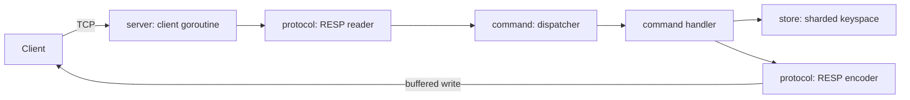

# Redis Clone in Go

A Redis-compatible in-memory key-value server written from scratch in Go, built to learn how Redis works internally: the TCP front end, the RESP wire protocol, command dispatch, and (in later phases) storage, expiration, and AOF persistence.

It uses only the Go standard library.

## Status

| Phase | Scope | State |
|-------|-------|-------|
| 1 | TCP server, one goroutine per client, graceful shutdown | Done |
| 2 | RESP parser/encoder, command dispatcher, `PING` / `ECHO` / `QUIT` | Done |
| 3 | In-memory store: `SET` `GET` `DEL` `EXISTS` | Done |
| 4 | `INCR` `DECR` `APPEND` `MGET` `MSET` `KEYS` `TYPE` | Next |
| 5–9 | TTL, AOF, benchmarks, Docker, config | Planned |

## Architecture



```
cmd/server/          entry point: flags, logging, signal handling
internal/server/     TCP listener, per-connection loop, shutdown
internal/protocol/   RESP types, streaming parser, encoder
internal/command/    dispatcher and command handlers
internal/store/      concurrency-safe in-memory keyspace
```

## RESP implementation

- `protocol.Reader` wraps the connection in a `bufio.Reader`, so a command split across many TCP reads, or several commands in one read, are both handled naturally. No code assumes one `Read()` equals one command.
- Requests are RESP arrays of bulk strings; plain-text inline commands (`PING`, `ECHO hi`) are also accepted, so `nc` works.
- Input is untrusted. Bulk length (512 MiB), array length (1M), inline line length (64 KiB), and nesting depth are all capped. Large bulk payloads grow as bytes arrive instead of being allocated up front from the declared length. Missing CRLF, bad lengths, and unknown type bytes return a `ProtocolError`; the server replies `-ERR Protocol error: ...` and closes the connection, as Redis does. The parser is fuzz-tested.
- Replies are written to a `bufio.Writer` that is flushed only right before the reader blocks on the socket. This way replies to pipelined commands go out in one write, and a trailing partial command never holds back replies to complete ones.

## Concurrency model

Each accepted connection gets its own goroutine. The server tracks live connections so `Close()` (triggered by SIGINT/SIGTERM) stops the listener, closes every client, and waits for their goroutines to exit. The dispatcher is read-only after construction, so it is shared without locks.

### Storage and locking

The keyspace is split into 64 shards. Each shard is a `map[string]*entry` guarded by its own `sync.RWMutex`, and every entry records its data type so later types (and `WRONGTYPE` errors) fit in without changing the layout.

- **Why shards instead of one global lock:** clients working on different keys usually hit different shards, so they don't serialize on a single mutex. Reads take the shared lock, so concurrent `GET`s on the same shard don't block each other either.
- **Shard selection:** `hash/maphash` with a random per-process seed, so a client can't pick keys that all land in one shard.
- **Immutable values:** stored byte slices are never modified in place. A reader can release the lock and encode the value without it changing underneath. Commands that modify a value (e.g. `APPEND`) must build a new slice.
- **Atomicity:** each single-key operation is atomic. Multi-key `DEL`/`EXISTS` lock one shard at a time, so they're atomic per key, not across all keys. Commands that need all-or-nothing behavior (e.g. `MSET`) will lock every shard they touch, in a fixed order to avoid deadlock.

## Commands

| Command | Notes |
|---------|-------|
| `PING [message]` | `PONG`, or echoes `message` |
| `ECHO message` | |
| `QUIT` | replies `OK`, then closes the connection |
| `SET key value` | options such as `EX`/`NX` not yet supported (`ERR syntax error`) |
| `GET key` | null bulk (`$-1`) if missing |
| `DEL key [key ...]` | number of keys removed |
| `EXISTS key [key ...]` | number of keys that exist; repeats count again |

Arity is checked centrally, Redis-style (positive = exact, negative = minimum). Errors match Redis wording, e.g. `ERR wrong number of arguments for 'echo' command`.

## Running

Requires Go 1.26+.

```sh
make run              # go run ./cmd/server (listens on localhost:6379)
make build            # bin/redis-clone
./bin/redis-clone -addr :6380
```

Try it:

```sh
redis-cli -p 6379 SET name Solan
redis-cli -p 6379 GET name
# or without redis-cli:
printf 'SET name Solan\r\nGET name\r\n' | nc localhost 6379
```

## Testing

```sh
make test             # go test ./...
make race             # go test -race ./...
make benchmark
go test -fuzz FuzzReadCommand -fuzztime 30s ./internal/protocol
```

The tests cover RESP parsing (all types, invalid input, truncated input, byte-at-a-time reads, large values), encoding round trips, dispatcher arity and errors, and store operations under concurrent access. End-to-end TCP tests cover pipelining, fragmented writes, protocol errors, `QUIT`, keys shared between clients, 50 concurrent clients, and shutdown.
